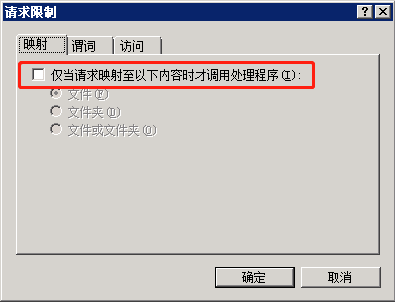

###########################################  
Windows 部署 Django  
###########################################

**0x00 环境**

> Windows Server 2008 r2  
> IIS 6.0  
> Python 3.6  
> Django 1.11.18  
> FastCGI 3.0  
> Anconda

> 重要：项目路径不可以存在中文

**0x01 测试项目是否可用**

`python manage.py runserver`

**0x02 打开 IIS 功能（省略）**

**0x03 安装 wfastcgi 模块**

`pip install wfastcgi`

**0x04 安装成功后执行如下命令 启动 wfastcgi 会生成<python 路径>|<wfastcgi 路径>**

`wfastcgi-enable`

**0x05 IIS 添加网站**

1. 网站 → 右键 → 添加网站

2. 填写相应参数

**0x06 IIS 添加程序映射**

1. 点击新建的网站 → 处理程序映射

2. 添加模块映射


```
请求路径：*
模块：FastCgiModule
可执行文件：python路径|wfastcgi路径
名称：随意 后面需要用到
```

3. 点击请求限制 取消选中，不是选中



4. 添加成功后返回主页 点击最上级的那个


**0x07 IIS 配置 FastCGI**

1. 选择 FastCGI 设置，找到刚才创建的那个，右键编辑


2. 点击环境变量，添加如下内容

```
WSGI_HANDLER：django.core.wsgi.get_wsgi_application()
DJANGO_SETTINGS_MODULE：<项目名>.settings
```


**0x08 配置 web.config 文件**

1. 在项目下创建 web.config 文件(默认情况下会自动创建)，内容如下

> 目前来看 `appSettings` 不配置也可以 直接使用默认的也没有问题


2. 如果上面配置的没有问题就可以访问了。

3. 如果报错 `500.19` 就执行如下命令 出现这个问题是因为 IIS7 以后采用了更安全的管理机制，默认情况下会锁住配置，不允许修改，所以解锁了就可以了

```
%windir%\system32\inetsrv\appcmd unlock config -section:system.webServer/handlers

%windir%\system32\inetsrv\appcmd unlock config -section:system.webServer/modules
```

4. 如果报错 400 就给项目文件夹赋一下权限

5. 但是现在访问静态资源时还是无法获取到，需要配置一下

**0x09 给静态资源添加虚拟目录**

1. 在 settings 文件中增加如下选项

```
STATIC_URL = '/static/'
STATICFILES_DIRS = (os.path.join(BASE_DIR, "static"),)
STATIC_ROOT  = os.path.join(BASE_DIR, 'static')
```

2. 收集静态文件

```
python manage.py collectstatic
```

3. 在 static 文件夹中创建 web.config 文件

```
<?xml version="1.0" encoding="UTF-8"?>
    <configuration>
      <system.webServer>
      <!-- this configuration overrides the FastCGI handler to let IIS serve the static files -->
      <handlers>
        <clear/>
	<!-- the configuration document write by Kahn.xiao -->
   <add name="<创建的模块映射的名字>" path="*" verb="*" modules="StaticFileModule" resourceType="File" requireAccess="Read" />
     </handlers>
   </system.webServer>
</configuration>
```
